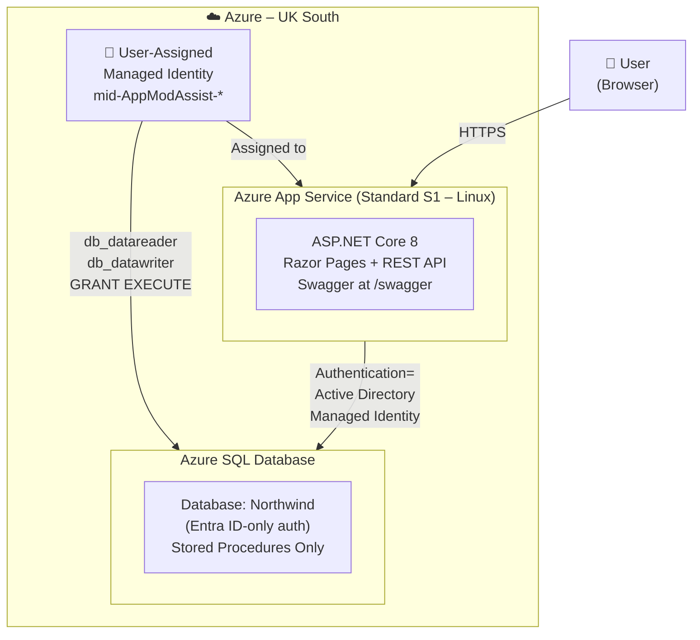

# Architecture Diagram – Expense Management System
# prompt-013-create-architecture-diagram
# Plain-text diagram plus Mermaid source for rendering in GitHub / docs tools.

## Overview

```
┌─────────────────────────────────────────────────────────────────────────┐
│                         Azure (UK South)                                │
│                                                                         │
│   ┌─────────────────────┐         ┌──────────────────────────────────┐  │
│   │  User-Assigned      │         │   Azure App Service              │  │
│   │  Managed Identity   │◄────────│   (Standard S1, Linux)           │  │
│   │                     │ assigned│                                  │  │
│   │  mid-AppModAssist-* │         │   ASP.NET Core 8 Razor Pages     │  │
│   └─────────┬───────────┘         │   + REST API (Swagger at /swagger│  │
│             │                     └────────────────┬─────────────────┘  │
│             │ principalId                          │                    │
│             │ (db_datareader,                      │ Authentication=    │
│             │  db_datawriter,                      │ Active Directory   │
│             │  GRANT EXECUTE)                      │ Managed Identity   │
│             │                                      │ (clientId from     │
│             │                                      │  AZURE_CLIENT_ID)  │
│             ▼                                      ▼                    │
│   ┌───────────────────────────────────────────────────────────────┐     │
│   │                   Azure SQL Database                          │     │
│   │                   Server: sql-appmodassist-*                  │     │
│   │                   Database: Northwind                         │     │
│   │                                                               │     │
│   │   • Entra ID-only authentication (no SQL auth)               │     │
│   │   • Tables: Roles, Users, ExpenseCategories,                  │     │
│   │             ExpenseStatus, Expenses                           │     │
│   │   • All access via stored procedures only                     │     │
│   └───────────────────────────────────────────────────────────────┘     │
│                                                                         │
└─────────────────────────────────────────────────────────────────────────┘

                              ▲ HTTPS
                              │
                         ┌────┴────┐
                         │  User   │
                         │(Browser)│
                         └─────────┘
```

## Mermaid Diagram



## Authentication Flow

1. **User → App Service**: HTTPS request to `https://<app>.azurewebsites.net/Index`
2. **App Service → SQL**: The app uses `Authentication=Active Directory Managed Identity` with the
   `AZURE_CLIENT_ID` environment variable pointing to the user-assigned managed identity's client ID.
3. **Managed Identity → Entra ID**: The identity token is fetched automatically by the SQL driver
   using the IMDS endpoint — no passwords, no secrets stored anywhere.
4. **SQL authorisation**: The managed identity is a database user with `db_datareader`,
   `db_datawriter`, and `EXECUTE` permissions, granted via `run-sql-dbrole.py`.

## Services Summary

| Service                     | SKU / Tier  | Purpose                             |
|-----------------------------|-------------|-------------------------------------|
| User-Assigned Managed Identity | —        | Passwordless auth for App → SQL     |
| Azure App Service           | Standard S1 | Hosts the ASP.NET Core application  |
| Azure SQL Database (Northwind) | Basic    | Expense data store                  |

## Deployment Scripts

```
deploy-infra.sh   →   Creates resource group, deploys Bicep (MI + App Service + SQL)
deploy-app.sh     →   Imports schema, configures roles, deploys stored procedures, builds & publishes app
```
